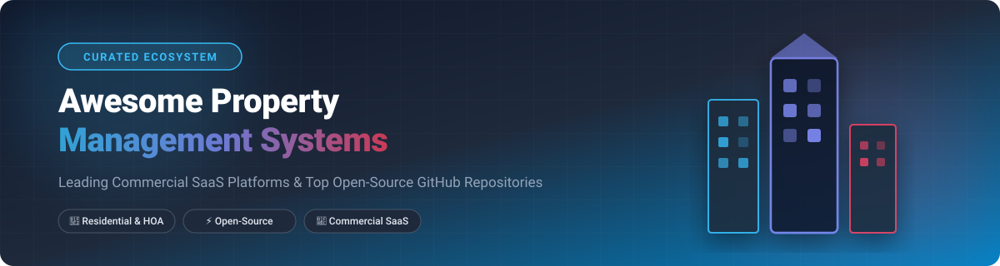

# 🏢 Awesome Property Management System (PMS)

  

  <strong>Curated List of SaaS Platforms & Top Open-Source GitHub Projects for Real Estate & Property Management</strong>

  
  
  
  

---

## 📌 Overview

Welcome to the **Awesome Property Management System (PMS)** directory! 🏠 This repository tracks top-tier **commercial SaaS platforms** and **open-source GitHub projects** designed for **residential, multifamily, HOA, commercial, and short-term property management**.

Whether you are an independent landlord, a large enterprise property manager, or a developer building custom PropTech solutions, this guide provides detailed insights into pricing, free tier limits, company market positioning, and repository popularity.

---

## 📑 Table of Contents

- [🏢 SaaS / Hosted Platforms](#-saas--hosted-platforms)
- [💻 Open-Source GitHub Projects](#-open-source-github-projects)
- [📊 Market Insights & Industry Overview](#-market-insights--industry-overview)
- [🛠️ How to Contribute](#️-how-to-contribute)
- [⚠️ Disclaimer](#️-disclaimer)

---

## 📊 Market Insights & Industry Overview

> 💡 **Sector Market Size & Dynamics:**  
> The global **Property Management Software (PMS) market size** is estimated at **$4.5B – $7.0B USD** (projected to reach over **$10B+ by 2030** with an 8.5%–10% CAGR).  
> The sector is **moderately fragmented** — dominated at the high enterprise end by category giants like RealPage, Yardi, and AppFolio, while long-tail independent landlords and mid-market operators are served by thousands of specialized SaaS vendors and emerging open-source solutions.

---

## 🏢 SaaS / Hosted Platforms

Below is a curated comparison of leading property management SaaS platforms, sorted by **Company Size / Valuation (Descending)**:

| Logo / Platform | Company Size & Revenue / Valuation | Starting Price (USD) | Free Tier / Free Trial Limits | Key Features & Focus |
| :--- | :--- | :--- | :--- | :--- |
| **[RealPage](https://www.realpage.com/)** | 🏢 **$10.2B Valuation** (~$1.2B Revenue, ~7,000 employees) | **$1.00 / unit / month** *(Base fee applies)* | ❌ **No Free Trial** *(Demo upon request)* | Enterprise multifamily analytics, yield management, & full-suite PMS solutions. |
| **[Yardi Voyager](https://www.yardi.com/)** | 🏢 **$1.6B - $1.8B Annual Revenue** (~9,000 employees) | **$1,200.00 / month** *(Enterprise base tier)* | ❌ **No Free Trial** *(Live guided demo available)* | Industry standard for enterprise multifamily, commercial, and mixed-use real estate portfolios. |
| **[AppFolio](https://www.appfolio.com/)** | 🏢 **$5.5B - $7.5B Market Cap** (~$1.12B Revenue, ~2,000 employees) | **$1.40 / unit / month** *($280/mo minimum)* | ❌ **No Free Trial** *(Interactive product demo available)* | Cloud-native mid-market & enterprise platform with AI-assisted leasing, accounting, and maintenance workflows. |
| **[Propertyware](https://www.propertyware.com/)** | 🏢 **$100M - $500M Revenue** *(Part of RealPage, ~500 employees)* | **$1.00 / unit / month** *($250/mo minimum + onboarding fee)* | 🎁 **Limited-Access Free Trial** *(Available upon sales request)* | Purpose-built property management software for single-family rental (SFR) portfolios and residential units. |
| **[Buildium](https://www.buildium.com/)** | 🏢 **$80M - $150M Revenue** *(Part of RealPage, ~300 employees)* | **$62.00 / month** *(Essential plan, up to 150 units)* | ⏳ **14-Day Free Trial** *(Full feature access, no credit card required)* | Comprehensive residential and HOA management software designed for small to mid-sized operators. |
| **[Entrata](https://www.entrata.com/)** | 🏢 **$100M - $200M Revenue** *(Valued at ~$3B after $507M funding)* | **Custom Quote** *(Contact sales for per-unit tiering)* | ❌ **No Free Trial** *(Customized sandbox demo provided)* | Modern single-database multifamily PMS with integrated tenant experience and portal suites. |
| **[DoorLoop](https://www.doorloop.com/)** | 🏢 **$20M - $50M Revenue** *(Raised $130M+ funding, ~150 employees)* | **$49.00 / month** *(Billed annually, first 20 units)* | ❌ **No Free Trial** *(1-on-1 demo & 30-day money-back guarantee)* | Modern, user-friendly PMS covering tenant screening, automated rent collection, accounting, and maintenance. |
| **[ResMan](https://www.resman.com/)** | 🏢 **$10M - $22M Revenue** (~150 employees, $60M+ funding) | **Custom Quote** *(Per-unit subscription model)* | ❌ **No Free Trial** *(Product walkthrough demo available)* | Dedicated multifamily and affordable housing management platform focusing on compliance and resident retention. |
| **[Rent Manager](https://www.rentmanager.com/)** | 🏢 **$10M - $30M Revenue** (~300 employees) | **$1.00 / unit / month** *($200/mo minimum commitment)* | ❌ **No Free Trial** *(Guided software demonstration available)* | Highly customizable property management software for residential, commercial, and manufactured housing. |
| **[Hemlane](https://www.hemlane.com/)** | 🏢 **$9M - $15M Revenue** (~55 employees, $15M valuation) | **$30.00 / month** *(Base fee + $2.80/unit/mo)* | ⏳ **14-Day Free Trial** *(Full access to Basic tier features)* | All-in-one platform for independent landlords and small portfolio managers with local repair coordination options. |
| **[Innago](https://www.innago.com/)** | 🏢 **$3M - $8M Revenue** (~40 employees) | **$0.00 / month** *(100% free landlord platform)* | ♾️ **Forever Free Plan** *(Unlimited units/tenants; standard tenant-paid fee structure)* | Free software for small-to-mid landlords for rent collection, digital lease signing, and work order tracking. |

---

## 💻 Open-Source GitHub Projects

Explore top open-source property management systems, frameworks, and modules on GitHub, sorted by **Star Count (Descending)**:

| Repository & Link | Stars Badge | Tech Stack / License | Description & Use Case |
| :--- | :--- | :--- | :--- |
| **[microrealestate/microrealestate](https://github.com/microrealestate/microrealestate)** |  | JavaScript / MIT | Complete self-hosted open-source property management platform for independent landlords to manage rents, leases, and properties. |
| **[java110/MicroCommunity](https://github.com/java110/MicroCommunity)** |  | Java / Apache-2.0 | Full-featured community and property management system for apartment complexes, smart residential communities, and property services. |
| **[etewiah/property_web_builder](https://github.com/etewiah/property_web_builder)** |  | Ruby on Rails / MIT | Open-source engine to build real estate websites, rental listing portals, and property showcase manager applications. |
| **[open-condo-software/condo](https://github.com/open-condo-software/condo)** |  | TypeScript / Node.js / MIT | Enterprise-grade open-source SaaS platform for apartment buildings, condominium management, and tenant mobile apps. |
| **[OCA/pms](https://github.com/OCA/pms)** |  | Python / AGPL-3.0 | Odoo Community Association official property management modules for multi-property real estate, lease accounting, and asset tracking. |
| **[pesanio/pesan-pms](https://github.com/pesanio/pesan-pms)** |  | TypeScript / AGPL-3.0 | Open-source PMS tailored for hotels, homestays, villas, and short-term rental property management. |
| **[Kamra-PMS/kamra-pms](https://github.com/Kamra-PMS/kamra-pms)** |  | Python (Frappe) / GPL-3.0 | Modern AI-native open-source property and hotel management system covering reservations, folios, housekeeping, and front desk operations. |

---

## 🛠️ How to Contribute

Contributions are welcome and greatly appreciated! 🤝

1. **Fork** the repository.
2. Create a new feature branch (`git checkout -b feature/add-new-pms`).
3. Add or update entries in `README.md` keeping formatting consistent.
4. Ensure factual links, clear descriptions, pricing, and GitHub links are provided.
5. **Commit** your changes and submit a **Pull Request (PR)**.

---

## ⚠️ Disclaimer

- This repository is a **community-curated list** for informational and educational purposes only.
- Mention of commercial SaaS tools or open-source projects does not constitute an official endorsement or recommendation.
- Property Management Systems handle confidential data, financial transactions, and personal tenant information. Ensure compliance with local housing laws, privacy acts (GDPR/CCPA), and financial security standards.

---

  <b>⭐ Star this repository if you find it helpful for your PropTech journey! ⭐</b> 
  <i>Maintained with ❤️ for property managers, landlords, and real estate developers.</i>

